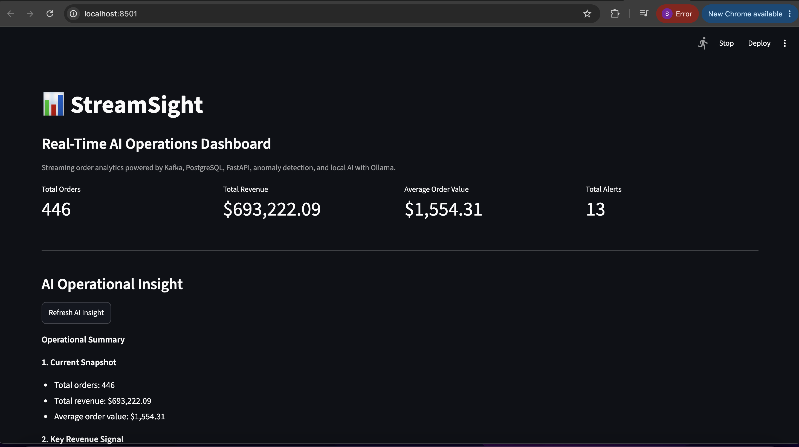
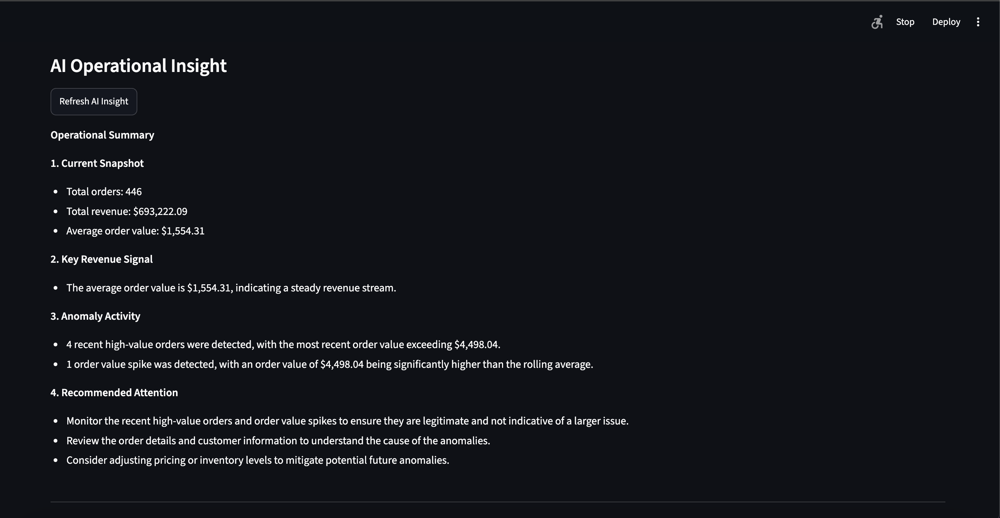
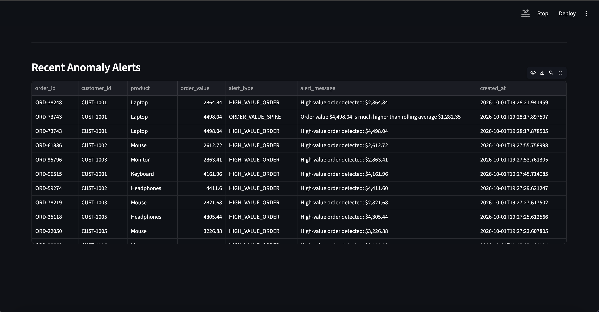

# StreamSight – Real-Time AI Operations Analytics

StreamSight is a real-time analytics and AI monitoring platform that processes live order events, detects operational anomalies, stores streaming data in PostgreSQL, exposes analytics through FastAPI, and presents insights through an interactive Streamlit dashboard.

The project demonstrates an end-to-end streaming analytics architecture using Kafka, PostgreSQL, FastAPI, Streamlit, Docker, and local AI with Ollama.

---

## Project Overview

Modern operational systems generate continuous streams of events that need to be monitored in real time.

StreamSight simulates an order-processing environment where order events are continuously generated and streamed through Kafka.

The system:

- generates live order events
- publishes events to Apache Kafka
- processes streaming events in real time
- calculates operational metrics
- detects abnormal order activity
- stores events and alerts in PostgreSQL
- exposes analytics through FastAPI
- generates AI-powered operational summaries using Ollama
- displays metrics, charts, alerts, and AI insights in Streamlit

---

## Application Preview

### Dashboard Overview



The dashboard provides real-time visibility into:

- total orders
- total revenue
- average order value
- anomaly alerts
- AI-generated operational insights

---

### AI Operational Insight




The AI layer analyzes current operational metrics and recent anomaly events to generate a concise business-oriented summary.

The summary includes:

- current operational snapshot
- key revenue signals
- anomaly activity
- recommended attention areas

The AI output is grounded in data retrieved from PostgreSQL.

---

### Real-Time Anomaly Alerts



StreamSight detects and stores operational anomalies such as:

- high-value orders
- order-value spikes relative to the rolling average

Each alert includes the related order, customer, product, value, alert type, message, and timestamp.

---

## Architecture

```text
                    ┌───────────────────────┐
                    │   Order Generator     │
                    │     Python            │
                    └──────────┬────────────┘
                               │
                               ▼
                    ┌───────────────────────┐
                    │    Kafka Producer     │
                    └──────────┬────────────┘
                               │
                               ▼
                    ┌───────────────────────┐
                    │     Apache Kafka      │
                    │   order-events topic  │
                    └──────────┬────────────┘
                               │
              ┌────────────────┼────────────────┐
              │                │                │
              ▼                ▼                ▼
   ┌──────────────────┐ ┌────────────────┐ ┌─────────────────────┐
   │ Order Consumer   │ │ Metrics Engine │ │ Anomaly Detector    │
   └─────────┬────────┘ └────────────────┘ └──────────┬──────────┘
             │                                         │
             ▼                                         ▼
   ┌─────────────────────────────────────────────────────────────┐
   │                       PostgreSQL                            │
   │              order_events + anomaly_alerts                 │
   └───────────────────────────┬─────────────────────────────────┘
                               │
                               ▼
                    ┌───────────────────────┐
                    │       FastAPI         │
                    │ Analytics REST API    │
                    └──────────┬────────────┘
                               │
                  ┌────────────┴────────────┐
                  │                         │
                  ▼                         ▼
       ┌────────────────────┐    ┌────────────────────┐
       │ Streamlit Dashboard│    │ Ollama LLM         │
       │ Live Analytics     │    │ AI Insight Service │
       └────────────────────┘    └────────────────────┘